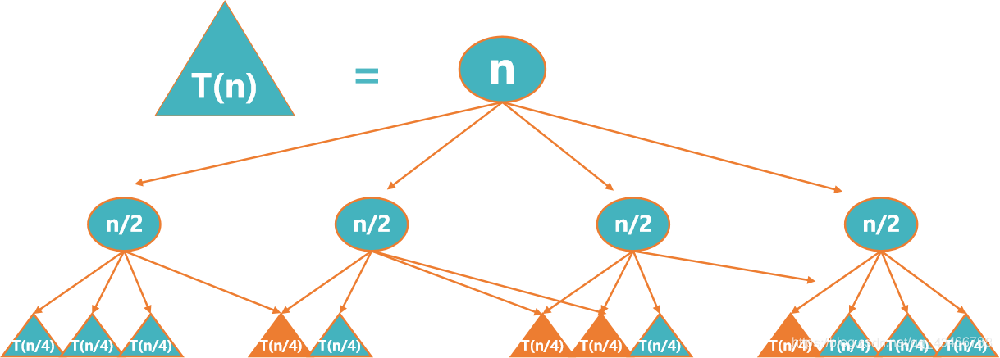

# 动态规划算法

## 总体思想
- 动态规划算法与分治法类似，其基本思想也是将待求解问题分解成若干个子问题
- 经分解得到的子问题往往不是互相独立的，有些子问题被重复计算多次
- 如果能够保存已解决的子问题的答案，而在需要时再找出已求得的答案，就可以避免大量重复计算，从而得到多项式时间算法（备忘录法）
- 图解：
                        

## 使用动态规划来求解的问题需要具备的基本要素包括：
**1、重复子问题**

- 递归算法求解问题时，每次产生的子问题并不总是新问题，有些子问题被反复计算多次，这种性质称为子问题的重叠性质
- 动态规划算法，对每一个子问题只解一次，而后将其解保存在一个表格中，当再次需要解此子问题时，只是简单地用常数时间查看一下结果
- 通常不同的子问题个数随问题的大小呈多项式增长，用动态规划算法只需要多项式时间，从而获得较高的解题效率

**2、最优子结构**
- 一个问题的最优解包含着其子问题的最优解，这种性质称为最优子结构性质
- 分析问题的最优子结构性质：首先假设由问题的最优解导出的子问题的解不是最优的，然后再设法说明在这个假设下可构造出比原问题最优解更好的解，从而导致矛盾
- 利用问题的最优子结构性质，以自底向上的方式递归地从子问题的最优解逐步构造出整个问题的最优解
- 最优子结构是一个问题能用动态规划算法求解的前提

**3、最动态规划算法与分治算法的异同点**
1. 动态规划算法与分治法类似，其基本思想也是将待求解问题分解成若干个子问题
2. 分治算法经分解得到的子问题往往是独立的
3. 动态规划算法经分解得到的子问题往往不是独立的，有些子问题被重复计算多次

**4、动态规划求解的基本步骤**
1. 找出最优解的性质，并刻划其结构特征
2. 递归地定义最优值
3. 以自底向上的方式计算出最优值
4. 根据计算最优值时得到的信息，构造最优解

### 数字三角形
